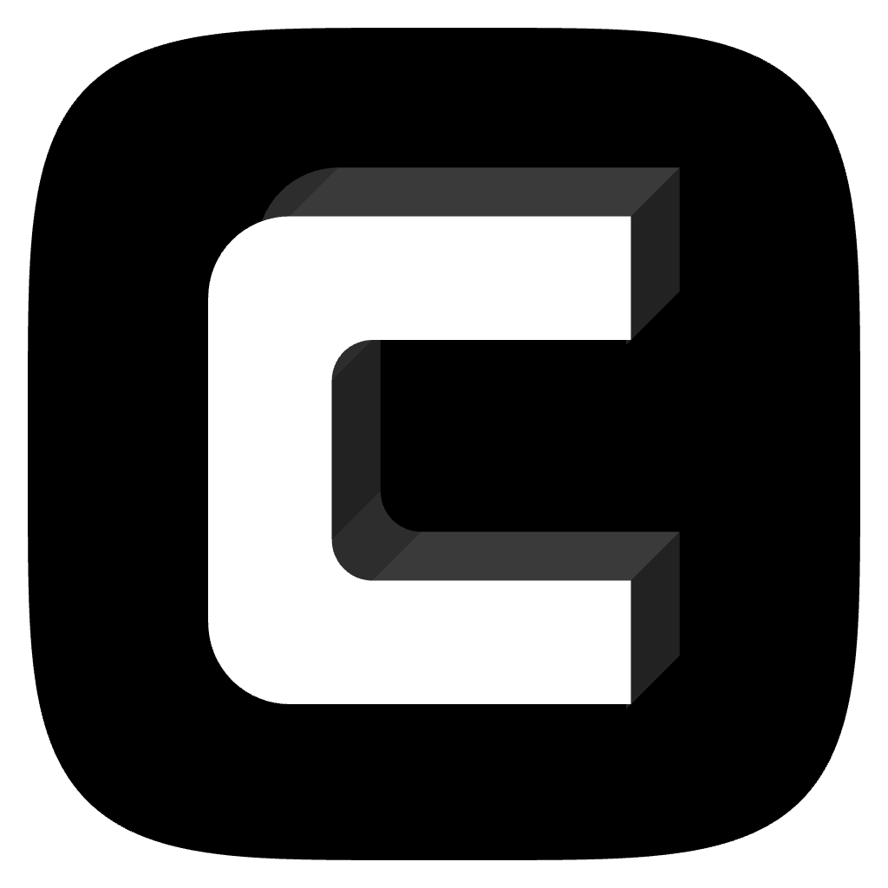

<div align="center">



**Clave is a macOS desktop app for managing multiple Claude Code sessions.**

Open as many sessions as you need, arrange them side-by-side, and switch between them instantly.

[Features](#features) · [Download](#download) · [Build from Source](#build-from-source) · [Contributing](#contributing)

</div>

<p align="center">
  <video src="assets/demo.mp4" alt="Clave demo" width="800" autoplay loop muted playsinline></video>
</p>

---

## Download

[**Download Clave v1.8.8**](https://github.com/codika-io/clave/releases/download/v1.8.8/clave-1.8.8.dmg) (macOS Universal — Apple Silicon & Intel) · [All releases](https://github.com/codika-io/clave/releases)

Download the `.dmg`, drag to Applications, done.

Auto-updates are built in — once installed, new versions download silently in the background.

## Features

- **Multi-session management** — Open unlimited Claude Code sessions, each in its own PTY
- **Flexible layouts** — Single, split (2-panel), or grid (4-panel) view modes
- **Searchable sidebar** — Filter sessions by name, folder, or path
- **Session naming** — Double-click or right-click to rename any session
- **Dark / Light themes** — Full theming for both terminal and UI
- **Native macOS feel** — Hidden inset titlebar with traffic light controls
- **Auto-updates** — New versions install automatically on quit via `electron-updater`
- **Signed & notarized** — Passes macOS Gatekeeper without warnings

## Requirements

- macOS (Apple Silicon or Intel)
- [Claude Code CLI](https://docs.anthropic.com/en/docs/claude-code) installed and authenticated

## Build from source

```bash
git clone https://github.com/codika-io/clave.git
cd clave
npm install
npm run dev          # development with hot reload
npm run build:mac    # build macOS .dmg (requires signing credentials)
```

## Tech stack

[Electron](https://www.electronjs.org/) · [React 19](https://react.dev/) · [TypeScript](https://www.typescriptlang.org/) · [xterm.js](https://xtermjs.org/) · [node-pty](https://github.com/microsoft/node-pty) · [Zustand](https://zustand.docs.pmnd.rs/) · [Tailwind CSS v4](https://tailwindcss.com/) · [Framer Motion](https://motion.dev/)

## Roadmap

- [ ] Linux support
- [ ] Windows support
- [ ] Session persistence across app restarts
- [ ] Configurable keybindings

## Contributing

See [CONTRIBUTING.md](CONTRIBUTING.md) for guidelines on reporting bugs, suggesting features, and submitting pull requests.

## License

[MIT](LICENSE)
